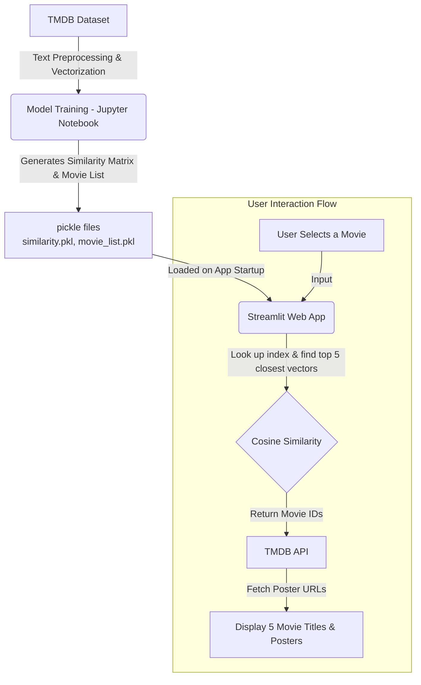

# 🎬 Movie Recommender System

A content-based movie recommender system that suggests movies based on similarities in their overviews, genres, keywords, cast, and crew. This project utilizes the TMDB (The Movie Database) dataset and employs Natural Language Processing (NLP) techniques along with Cosine Similarity to find movies that closely match your taste.

## ✨ Features

- **Content-Based Filtering**: Recommends movies similar to the one selected by the user.
- **Interactive UI**: Built with Streamlit for a clean, user-friendly interface.
- **Dynamic Posters**: Fetches high-quality movie posters in real-time using the TMDB API.
- **Fast and Efficient**: Pre-computes cosine similarity and leverages serialized models (pickle) for quick recommendations.

## 🏗️ System Architecture & Data Flow



## 🛠️ Technology Stack

- **Language**: Python
- **Web Framework**: Streamlit
- **Data Manipulation**: Pandas, NumPy
- **Machine Learning / NLP**: Scikit-Learn (CountVectorizer/TfidfVectorizer), NLTK (Stemming/Lemmatization)
- **API**: TMDB API for fetching movie details and images
- **Serialization**: Pickle

## 🚀 Getting Started

### Prerequisites
Make sure you have Python installed on your system.

### Installation

1. **Clone the repository:**
   ```bash
   git clone <your-repo-url>
   cd movie-recommend-main/movie-recommend
   ```

2. **Install dependencies:**
   Ensure you have all the required libraries installed. You can install them using pip:
   ```bash
   pip install streamlit pandas numpy scikit-learn nltk requests
   ```

3. **Get your TMDB API Key:**
   - Create an account at [The Movie Database (TMDB)](https://www.themoviedb.org/).
   - Generate an API key from your account settings.
   - Replace the API key in `app.py` inside the `fetch_poster` function.

4. **Run the Application:**
   ```bash
   streamlit run app.py
   ```

### Directory Structure
- `app.py`: The main Streamlit web application script.
- `notebook86c26b4f17.ipynb`: Jupyter notebook containing the code for data gathering, cleaning, preprocessing, and building the cosine similarity model.
- `model/`: Directory to store the serialized `movie_list.pkl` and `similarity.pkl` files (generated from the notebook).

## 💡 How It Works
1. **Data Preprocessing**: The notebook processes the TMDB dataset, combining relevant columns (genres, keywords, cast, crew, overview) into a single "tags" string for each movie.
2. **Vectorization**: The synthesized text is transformed into numerical vectors using text vectorization techniques (e.g., Bag of Words).
3. **Similarity Calculation**: Cosine similarity is calculated between all movie vectors to measure how closely related they are.
4. **Recommendation**: When a user selects a movie, the system fetches the top 5 movies with the highest cosine similarity scores and displays them alongside their respective posters fetched via the TMDB API.
